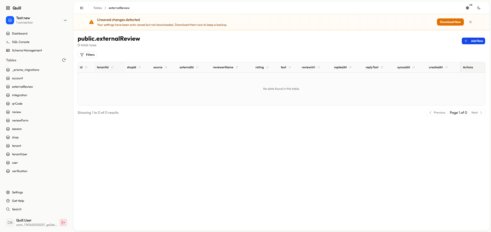

# Quill - PostgreSQL Database Administration Tool

A modern, web-based PostgreSQL database administration tool. Browse tables, edit records, run queries, and manage your database with an intuitive interface. Secure, fast, and easy to use.

Built with [Next.js](https://nextjs.org), React, and TypeScript.

<div align="center">
  
</div>

## ✨ Features

### Core Functionality

- **Database Management** - Connect to multiple PostgreSQL databases with encrypted credential storage
- **Table Browser** - Explore tables, schemas, columns, indexes, and foreign keys
- **Data Operations** - Create, read, update, and delete records with password-protected mutations
- **SQL Console** - Execute custom SQL queries with syntax highlighting, query history, and transaction support
- **Schema Management** - View and manage database schemas, create tables, and modify structure
- **AI Assistant** - Chat with AI to generate SQL queries, explore data, and understand your database schema using natural language

### Advanced Features

- **Advanced Filtering** - Multi-type filters (text, number, date, boolean, foreign keys) with complex query building
- **Custom Dashboards** - Create dashboard cards and charts from database data or custom SQL queries
- **Data Visualization** - Build interactive charts (line, bar, area) with date range filtering and trend indicators
- **Global Search** - Search across all tables and data in your database
- **Multi-language Support** - English, French, and German translations
- **Dark/Light Theme** - Toggle between themes
- **Customizable Sidebar** - Organize tables with custom icons, names, and drag-and-drop ordering

## 🚀 Getting Started

### Prerequisites

- Node.js 18+
- PostgreSQL database
- pnpm (recommended)
- Google AI API key (for AI chat feature) - Get one from [Google AI Studio](https://aistudio.google.com/apikey)

### Installation

1. Clone the repository:

   ```bash
   git clone <repository-url>
   cd postadmin
   ```

2. Install dependencies:

   ```bash
   pnpm install
   ```

3. Set up environment variables:

   Create a `.env.local` file in the root directory:
   ```bash
   GOOGLE_GENERATIVE_AI_API_KEY=your_google_ai_api_key_here
   ```
   
   **Note:** The AI chat feature requires a Google AI API key. You can get one from [Google AI Studio](https://aistudio.google.com/apikey).

4. Run the development server:

   ```bash
   pnpm dev
   ```

5. Open [http://localhost:3000](http://localhost:3000) and connect to your PostgreSQL database.

Your connection details are encrypted and stored locally in your browser.

## 📖 Usage

- **Connect**: Enter your PostgreSQL connection string on the login page
- **Browse**: Select tables from the sidebar to view and edit data
- **Filter & Sort**: Use the filter panel and column headers to query data
- **Query**: Execute custom SQL queries in the SQL console
- **Dashboard**: Create custom cards and charts to visualize your data
- **Schema**: Manage database structure through the schema management interface

## 🛠️ Technology Stack

- **Framework**: Next.js 16 (App Router)
- **UI**: React 19, TypeScript, Tailwind CSS, shadcn/ui
- **State**: Zustand, TanStack Query
- **Database**: PostgreSQL (via `pg`)
- **Other**: CryptoJS (encryption), Recharts (visualization), dnd-kit (drag & drop)

## 📁 Project Structure

```text
postadmin/
├── app/              # Next.js app directory (routes & API)
├── components/       # React components
│   ├── auth/        # Authentication
│   ├── dashboard/    # Dashboard components
│   └── ui/          # UI components (shadcn/ui)
├── hooks/           # Custom React hooks
├── lib/             # Utilities
│   ├── db/         # IndexedDB & encryption
│   ├── helpers/    # Helper functions
│   ├── postgres/   # PostgreSQL client
│   ├── stores/     # Zustand stores
│   └── translations/ # i18n
└── types/           # TypeScript definitions
```

## 🔒 Security

- Database credentials encrypted with AES and stored locally (IndexedDB)
- All mutation operations require password confirmation
- Never commit database credentials to version control

## 📄 License

This project is licensed under a **Non-Commercial Open Source License**.

- ✅ **Free to use** - Use for any non-commercial purpose
- ✅ **Free to modify** - Modify the code to suit your needs
- ❌ **Cannot sell** - Cannot be sold or used in commercial products without permission
- 🔄 **Contribute changes** - Submit Pull Requests for modifications
- 📝 **Keep it open** - Distribution must include source code and license

For commercial licensing inquiries, please contact the project maintainers.

## 🤝 Contributing

Contributions are welcome! Please read [CONTRIBUTING.md](CONTRIBUTING.md) for guidelines.

1. Fork the repository
2. Create your feature branch
3. Make your changes and test thoroughly
4. Submit a Pull Request with a clear description

By contributing, you agree that your contributions will be licensed under the same Non-Commercial Open Source License.
